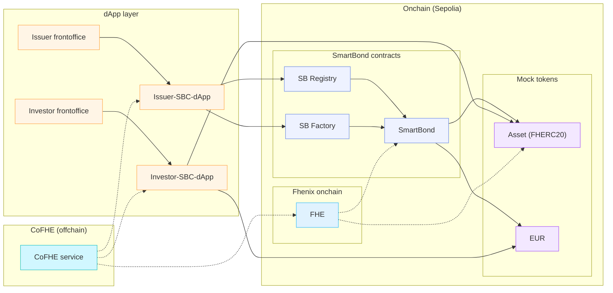

# 🔐 FHE dApp – Confidential Smart Bonds powered by Fhenix FHE

> This document was prepared with AI assistance and reviewed for accuracy. 

A decentralized application (dApp) for issuing, managing, and redeeming **confidential bonds (smart bonds)** on the Ethereum blockchain. The core idea: Sensitive financial parameters such as nominal values, coupon rates, maturities, and balances are encrypted using **Fully Homomorphic Encryption (FHE)** via the [Fhenix protocol](https://www.fhenix.io/) – calculations (interest calculation, payout determination, capping) take place **directly on the encrypted data** on-chain.

> **Note:** This project serves as the central work for my bachelor’s thesis. It focuses on integrating Fully Homomorphic Encryption (FHE) with the Fhenix framework and is not intended to be a complete, production-ready setup. The UI still has several areas under development, but the FHE integration is functional.

## 📑 Table of contents

- [Overview](#overview)
- [Architecture](#architecture)
- [What is Fhenix FHE?](#what-is-fhenix-fhe)
- [Smart Contracts (On-Chain)](#smart-contracts-on-chain)
- [Frontend (Off-Chain)](#frontend-off-chain)
- [Tech Stack](#tech-stack)
- [Installation & Setup](#installation--setup)
- [Usage](#usage)
- [Project Structure](#project-structure)

---

## Overview

FHE-dApp digitally maps the entire life cycle of a bond:

1. **Issuance** – An issuer creates a new bond with encrypted parameters (cap, price, coupon rate, maturity).
2. **Subscription** – Investors purchase bond tokens during the subscription period using an ERC-20 payment token.
3. **Issuance Close** – The issuer closes the issuance; interest and payout are calculated on-chain from the encrypted values.
4. **Funding** – The issuer deposits the payout amount as escrow.
5. **Redemption** – Investors redeem their bond tokens; a two-step process (decrypt request → claim) decrypts the payout and transfers the payment tokens.

**What makes it special:** All core financial figures – nominal values, balances, interest, payouts – remain encrypted throughout the entire process. Only authorized parties (issuer, bond contract, token contract) are granted access to the encrypted handles via `FHE.allow()`.

---

## Architecture


## What is Fhenix FHE?

### Fully Homomorphic Encryption (FHE)

**Fully Homomorphic Encryption** is an encryption technique that allows calculations to be performed **directly on encrypted data**—without ever having to decrypt it. The result of the calculation is itself encrypted and can only be decrypted by authorized parties.

### Fhenix & CoFHE

[**Fhenix**](https://www.fhenix.io/) brings FHE to the Ethereum blockchain. At the core of the integration is the **CoFHE (Coprocessor for FHE)** system:

- **On-Chain (Solidity) :** The library [`@fhenixprotocol/cofhe-contracts`](https://github.com/fhenixprotocol/cofhe-contracts) provides encrypted data types (`euint64`, `euint128`, `ebool`) and operations (`FHE.add`, `FHE.mul`, `FHE.div`, `FHE.sub`, `FHE.select`, `FHE.gt`, `FHE.gte`). Values are stored as **handles** (references to encrypted values in the CoFHE coprocessor).

- **Off-Chain (TypeScript):** The [`cofhejs`](https://www.npmjs.com/package/cofhejs) library enables:
- **Encryption** of plaintext values to FHE inputs (`cofhejs.encrypt(...)`)
- **Decryption** of FHE handles back to plaintext (`cofhejs.decrypt (handle, FheTypes.Uint64)`)
- **Permit management** – Permits authorize the dApp to access encrypted values

### Access control with `FHE.allow()` / `FHE.allowThis()`

A central concept in Fhenix is **access control to encrypted values**:

| Function | Meaning |
|---|---|
| `FHE.allow(handle, address)` | Allows a specific address to read/use the encrypted value |
| `FHE.allowThis(handle)` | Allows the current contract to use the value |
| `FHE.allowSender(handle)` | Allows `msg.sender` to read the value |

Without an explicit `allow`, no other contract or address can access the encrypted value—this is the basis of confidentiality.

### FHE data types in this project

| Type | Description | Usage |
|---|---|---|
| `euint64` | Encrypted 64-bit unsigned integer | Prices, balances, coupon rates, timestamps, caps |
| `euint128` | Encrypted 128-bit unsigned integer | Intermediate calculations (avoiding overflow) |
| `ebool` | Encrypted Boolean | Condition checks (e.g., maturity reached?) |
| `InEuint64` | Input struct for encrypted values | Transfer of encrypted values from front end to contracts |

### Decryption (decrypt flow)

Fhenix uses an **asynchronous decrypt process**:

1. `FHE.decrypt(handle)` – Starts decryption in the CoFHE coprocessor
2. `FHE.getDecryptResultSafe(handle)` – Checks whether the result is ready and returns the plaintext

This two-step process is used in redemption: First, the payout is calculated in encrypted form and decryption is requested, then the plaintext amount is retrieved and paid out as an ERC-20 transfer.

---

## Smart Contracts (On-Chain)

All contracts are located in the `onchain/src/` directory and are built and tested with **Foundry**.

### SmartBondFactory

> [`onchain/src/SmartBondFactory.sol`](./onchain/src/SmartBondFactory.sol)

Factory contract for creating new bonds. Accepts encrypted inputs (`InEuint64`), converts them to on-chain FHE handles, and deploys:
- A `BondAssetToken` (FHERC20-based bond token)
- A `SmartBond` (lifecycle contract)
- Registers the bond in the `SmartBondRegistry`

### SmartBond

> [`onchain/src/SmartBond.sol`](./onchain/src/SmartBond.sol)

The core contract for the bond lifecycle:

| Function | Description |
|---|---|
| `buy(paymentAmount)` | Purchase of bond tokens; token calculation is encrypted via FHE |
| `closeIssuance()` | Closes the subscription; calculates interest and total payout in encrypted form |
| `fundUpfront(amount)` | Deposits ERC-20 as payout escrow |
| `redeem(tokenAmountEnc)` | Starts redemption with encrypted amount (decrypt request) |
| `claimRedeem()` | Requests decrypted payout result and transfers ERC-20 |
| `finalize(issuerAdmin)` | Closes bond definitively, transfers remaining amounts |

**FHE highlights:**
- Token calculation: `tokenAmount = (paymentAmount × 1e6) / priceAtIssue` – completely on `euint128` with overflow clamping
- Interest calculation: `interest = (soldNotional × couponRate × duration) / (365 days × 1e18)`
- Maturity check: `FHE.gte(block.timestamp, maturityDate)` – maturity check on encrypted date

### BondAssetToken

> [`onchain/src/BondAssetToken.sol`](./onchain/src/BondAssetToken.sol)

Confidential ERC-20 token based on Fhenix **FHERC20**:
- **Encrypted balances** and **encrypted total supply**
- **Encrypted cap** – Minting is limited to the remaining capacity using `FHE.select`
- **Whitelist-gated** – Only whitelisted addresses may receive tokens
- Automatic access control via `_update()` override

### SmartBondRegistry

> [`onchain/src/SmartBondRegistry.sol`](./onchain/src/SmartBondRegistry.sol)

Registry of all issued bonds. Stores encrypted handles for maturity and notional cap. Uses OpenZeppelin `AccessControl` with a `FACTORY_ROLE`.

### MockLURC

> [`onchain/src/MockLURC.sol`](./onchain/src/MockLURC.sol)

Mock ERC-20 token as payment currency for tests and demos. Provides admin-controlled `mint()`/`burn()` functions.

### On-Chain Dependencies (Git Submodules)

| Library | Purpose |
|---|---|
| `@fhenixprotocol/cofhe-contracts` | Fhenix FHE Solidity library (`FHE.sol`, `FHERC20.sol`) |
| `@openzeppelin/openzeppelin-contracts` | Standard utilities (AccessControl, SafeERC20, ReentrancyGuard) |
| `forge-std` | Foundry Test Framework |

---

## Frontend (Off-Chain)

The frontend is an **Angular 21** single-page application with **PrimeNG** as the UI framework.

### Services

| Service | File | Task |
|---|---|---|
| `WalletService` | `src/app/services/wallet.service.ts` | MetaMask connection via Wagmi, chain enforcement (Sepolia), **CoFHE initialization** (TFHE WASM + `cofhejs.initializeWithViem`) |
| `CoFheService` | `src/app/services/co-fhe.service.ts` | Bond issuance (encryption + contract call), bond query (decryption of registry data), redemption (two-step decrypt flow) |

### Components / Views

| Route | Component | Description |
|---|---| ---|
| `/investor` | `InvestorComponent` | Dashboard for investors – bond overview, purchase, redemption |
| `/issuer` | `IssuerComponent` | Dashboard for issuers – bond issuance, issuance close, funding, whitelist management |

### CoFHE integration in detail

**Encryption (issuance):**
```typescript
const encrypt = await cofhejs.encrypt([
Encryptable.uint64(String(bond.cap)),
Encryptable.uint64(String(bond.priceAtIssue)),
Encryptable.uint64(String(bond.couponRatePerYear)),
Encryptable.uint64(String(unixSeconds))
]);
```
The encrypted handles are then passed as `InEuint64` to `SmartBondFactory.createBond()`.

**Decryption (bond query):**
```typescript
const maturityDate = this.unwrap(
await cofhejs.decrypt(result[i].maturityDate, FheTypes.Uint64)
);
```
Decryption only works if the user has a valid **Permit** (automatically generated during CoFHE initialization).

**Redemption (two-step decryption):**
1. `redeem()` – Encrypted payout is calculated on-chain, `FHE.decrypt()` is requested
2. Polling loop: `claimRedeem()` is called every 4 seconds until `FHE.getDecryptResultSafe()` delivers the plaintext

---

## Tech Stack

### Frontend
| Technology | Version | Purpose |
|---|---|---|
| Angular | 21.x | SPA framework |
| PrimeNG | 21.x | UI components (Lara Dark Theme) |
| Wagmi / Viem | 3.x / 2.x | Ethereum wallet integration |
| cofhejs | 0.3.x | Fhenix FHE client library |
| MetaMask SDK | 0.34.x | Wallet connector |

### Smart Contracts
| Technology | Purpose |
|---|---|
| Solidity | ^0.8.24 / ^0.8.25 |
| Foundry (Forge) | Build, test, deploy |
| Fhenix cofhe-contracts | FHE on-chain operations |
| OpenZeppelin | Access Control, SafeERC20, ReentrancyGuard |

### Network
| Parameter | Value |
|---|---|
| Chain | **Ethereum Sepolia Testnet** |
| Deployed Contracts | MockLURC, SmartBondRegistry, SmartBondFactory |

---

## Prerequisites

- **Node.js** >= 18.x
- **npm** or **yarn**
- **Angular CLI** (`npm install -g @angular/cli`)
- **Foundry** ([Installation](https://book.getfoundry.sh/getting-started/installation))
- **MetaMask** browser extension
- Sepolia ETH for gas fees (e.g., via a [faucet](https://sepoliafaucet.com/))

---

## Installation & Setup

### Disclaimer
The existing contracts are restricted to a particular wallet, and all contracts need to be redeployed under a new sender address to behave as expected.

### 1. Clone repository

```bash
git clone --recurse-submodules https://github.com/Lyxxrn/FHE-dApp.git
cd FHE-dApp
```

### 2. Install frontend

```bash
npm install
```

### 3. Build smart contracts

```bash
cd onchain
forge build
cd ..
```

### 4. Generate ABIs (Wagmi CLI)

```bash
npx wagmi generate
```
This generates `src/generated.ts` with the TypeScript ABIs of the smart contracts.

### 5. Start development server

```bash
ng serve
```

The app is accessible at `http://localhost:4200/`.

### 6. Deploy smart contracts

```bash
cd onchain
forge script script/BondContracts.s.sol:BondContracts \
--rpc-url $SEPOLIA_RPC_URL \
--private-key $PRIVATE_KEY \
--broadcast
```

Then adjust the addresses in `src/environments/environment.development.ts`.

---

## Usage

1. **Connect MetaMask** – The app automatically requests a connection to the Sepolia network and initializes CoFHE.
2. **Get Sepolia ETH** - Use any available Faucet to get testing ETH. (e.g. https://cloud.google.com/application/web3/faucet/ethereum/sepolia)
3. **Issuer view (`/issuer`)**:
- Mint LURC tokens (faucet)
- Issue new bonds (all parameters are FHE-encrypted)
- Whitelist investors
- Close issuance, deposit payout
3. **Investor view (`/investor`)**:
- View available bonds (encrypted values are decrypted in the browser)
- Buy bond tokens
- After maturity: Start redemption and receive payout

---

## Project structure

```
FHE-dApp/
├── onchain/ # Smart Contracts (Foundry)
│ ├── src/
│ │ ├── SmartBond.sol # Bond lifecycle with FHE
│ │ ├── SmartBondFactory.sol # Factory for bonds
│ │ ├── SmartBondRegistry.sol # Bond registry with FHE handles
│ │ ├── BondAssetToken.sol # FHERC20 bond token
│ │ ├── MockLURC.sol # Mock payment token (ERC-20)
│ │ └── FhenixContracts/ # Fhenix FHERC20 base class
│ ├── script/
│ │ └── BondContracts.s.sol # Deploy script
│ ├── test/ # Foundry tests
│ ├── lib/ # Git submodules (OZ, forge-std, cofhe)
│ └── foundry.toml # Foundry configuration
│
├── src/ # Angular frontend
│ ├── app/
│ │ ├── services/
│ │ │ ├── wallet.service.ts # Wallet + CoFHE Init
│ │ │ └── co-fhe.service.ts # Bond Logic + FHE Encrypt/Decrypt
│ │ ├── investor/ # Investor Dashboard
│ │ ├── issuer/ # Issuer Dashboard + Faucet
│ │ ├── shared/ # Shared Components
│ │ ├── sidebar/ # Navigation
│ │ ├── wallet/ # Wallet UI
│ │ ├── app.ts # Root Component
│ │ ├── app.routes.ts # Routing
│ │ └── app.config.ts # Angular Config + PrimeNG Theme
│ ├── environments/
│ │ └── environment.development.ts # Contract Addresses & Chain Config
│ ├── generated.ts # Auto-generated ABIs (wagmi)
│ └── index.html
│
├── wagmi.config.ts # Wagmi CLI Configuration
├── angular.json # Angular Build Config
├── package.json
└── tsconfig.json
```

---

---


